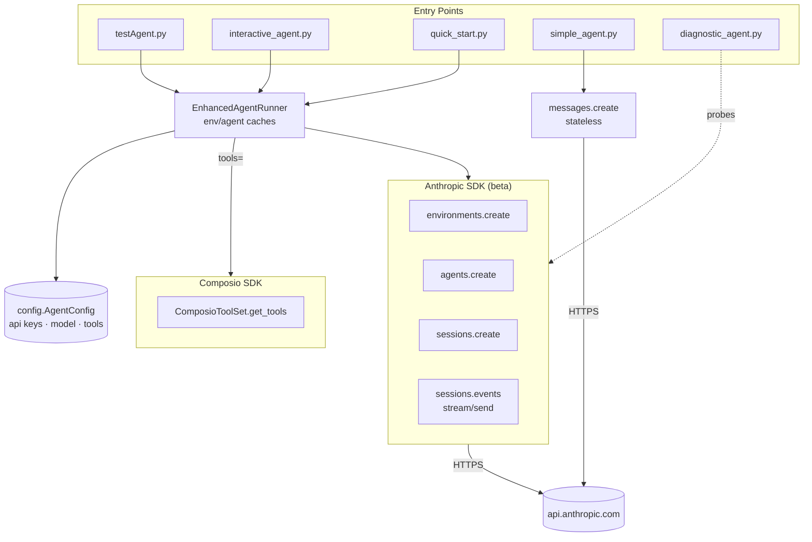

# ComposioAgent — Architecture

How the entry points, runner, and external APIs (Anthropic + Composio) fit together.

## Component map

```
┌──────────────────────────────────────────────────────────────────────────┐
│                              ENTRY POINTS                                │
│                                                                          │
│   testAgent.py     interactive_agent.py     quick_start.py               │
│   (test harness)   (REPL)                   (smoke test)                 │
│                                                                          │
│   simple_agent.py             diagnostic_agent.py                        │
│   (standalone, no beta)       (probe which models work)                  │
└────────┬─────────────────────────────────────────┬───────────────────────┘
         │                                         │
         │ instantiates                            │ uses
         ▼                                         ▼
┌──────────────────────────────────┐    ┌──────────────────────────────┐
│   EnhancedAgentRunner            │    │   config.AgentConfig         │
│   (enhanced_agent_runner.py)     │◄───┤   - anthropic_api_key        │
│                                  │    │   - composio_api_key         │
│   - _environment_cache           │    │   - model: claude-sonnet-4-6 │
│   - _agent_cache                 │    │   - networking_type          │
│   - composio (optional)          │    │   - enable_composio          │
│                                  │    │   - allowed_tools[]          │
│   Methods:                       │    └──────────────────────────────┘
│   ├─ get_or_create_environment() │
│   ├─ create_enhanced_agent()     │
│   └─ run_agent_task() ────────┐  │
└─────────┬───────────────────┐ │  │
          │                   │ │  │
          │ Anthropic SDK     │ │  │ Composio SDK (optional)
          ▼                   │ │  ▼
┌──────────────────────────┐  │ │  ┌──────────────────────────┐
│  anthropic.Anthropic     │  │ │  │ composio_anthropic.      │
│                          │  │ │  │  ComposioToolSet         │
│  client.beta.            │  │ │  │                          │
│  ├─ environments.create  │  │ │  │ .get_tools(actions=[...])│
│  ├─ agents.create        │  │ │  │   returns tool schemas   │
│  ├─ sessions.create      │  │ │  │   (Anthropic format)     │
│  └─ sessions.events      │  │ │  └────────────┬─────────────┘
│     ├─ .stream() ◄───────┘  │ │               │
│     └─ .send()              │ │               │ merged into
│                             │ │               ▼
│  client.messages.create ◄───┘ │  ┌──────────────────────────┐
│  (simple_agent.py only)       │  │ tools=[                  │
└──────────────┬────────────────┘  │   {agent_toolset_…},     │
               │                   │   <composio tools…>      │
               │ HTTPS             │ ]  ← passed to agents.create
               ▼                   └──────────────────────────┘
┌──────────────────────────┐
│  api.anthropic.com       │
│                          │
│  /v1/environments        │   sandbox + networking
│  /v1/agents              │   model + system + tools
│  /v1/sessions            │   binds agent ↔ environment
│  /v1/sessions/.../events │   bidirectional SSE
│  /v1/messages            │   stateless chat (simple_agent)
└──────────────────────────┘
```

## Call sequence — `run_agent_task()` (hot path)

```
User ──► run_agent_task(message)
            │
            ├─► create_enhanced_agent()
            │     ├─► (if Composio) composio.get_tools(actions=allowed_tools)
            │     └─► POST /v1/agents       ─► returns agent_id  (cached)
            │
            ├─► get_or_create_environment()
            │     └─► POST /v1/environments ─► returns env_id    (cached)
            │
            ├─► POST /v1/sessions {agent, environment_id}        ─► session_id
            │
            └─► sessions.events.stream(session_id)
                  ├─► .send(user.message)
                  └─► loop: read events
                       ├─ agent.message       → append text to output
                       ├─ agent.tool_use      → log tool name (executed by env)
                       ├─ session.status_idle → stop_reason ≠ requires_action → break
                       └─ session.status_terminated → break
```

## Mermaid version



## Key concepts

| Layer | Purpose | API |
|---|---|---|
| **Environment** | Sandboxed cloud workspace (filesystem + networking policy). `cloud` + `unrestricted`. | `beta.environments` |
| **Agent** | Model + system prompt + tool schemas. Reusable across sessions. | `beta.agents` |
| **Session** | One run: binds an agent to an environment with a timeout. | `beta.sessions` |
| **Events** | Bidirectional stream — send `user.message`, receive `agent.message` / `agent.tool_use` / status. | `beta.sessions.events` |
| **Composio tools** | Pre-built integrations (GitHub, Gmail, Slack, Sheets). Composio returns Anthropic-formatted tool schemas; bundle them into `tools=` on `agents.create`. The model emits tool calls; the env (or Composio) executes them. | `ComposioToolSet.get_tools()` |
| **Messages API** | Non-agentic fallback in `simple_agent.py` — stateless chat, no environment, no tools. | `messages.create` |

## File responsibilities

| File | Role |
|---|---|
| `config.py` | Single `AgentConfig` dataclass loaded via `.env`. Source of truth for keys, model, networking, allowed tools. |
| `enhanced_agent_runner.py` | Core `EnhancedAgentRunner`. Caches env + agent IDs; runs sessions with streamed events; optional Composio integration. |
| `interactive_agent.py` | Terminal REPL wrapping the runner. |
| `testAgent.py` | Comprehensive test harness — env check, imports, agent creation, simple + code-gen tasks. |
| `quick_start.py` | Minimal smoke test / quick entry. |
| `simple_agent.py` | Standalone fallback using the standard Messages API (no beta needed). |
| `diagnostic_agent.py` | Probes which Anthropic models are supported by the beta agents endpoint. |
| `setup_agent.py` | One-time setup helper. |
